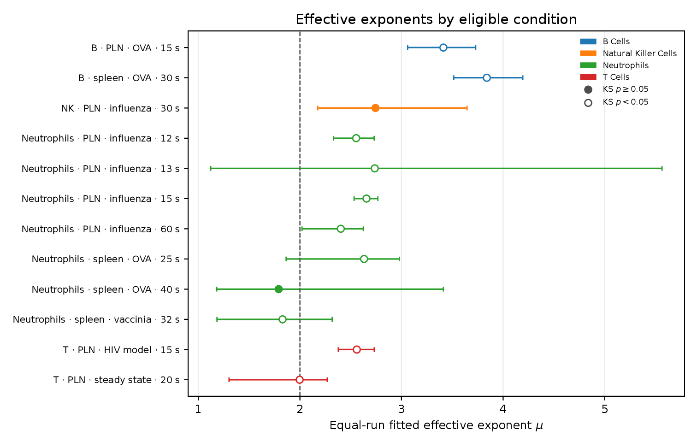
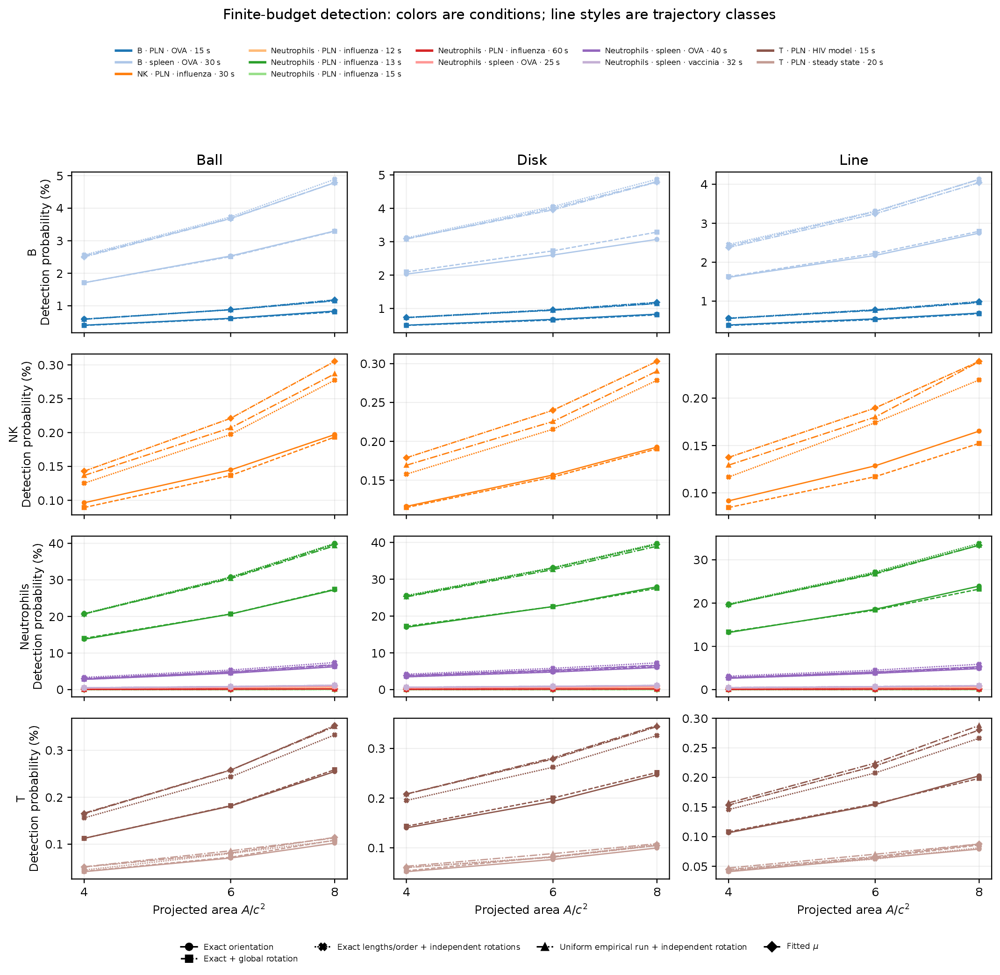
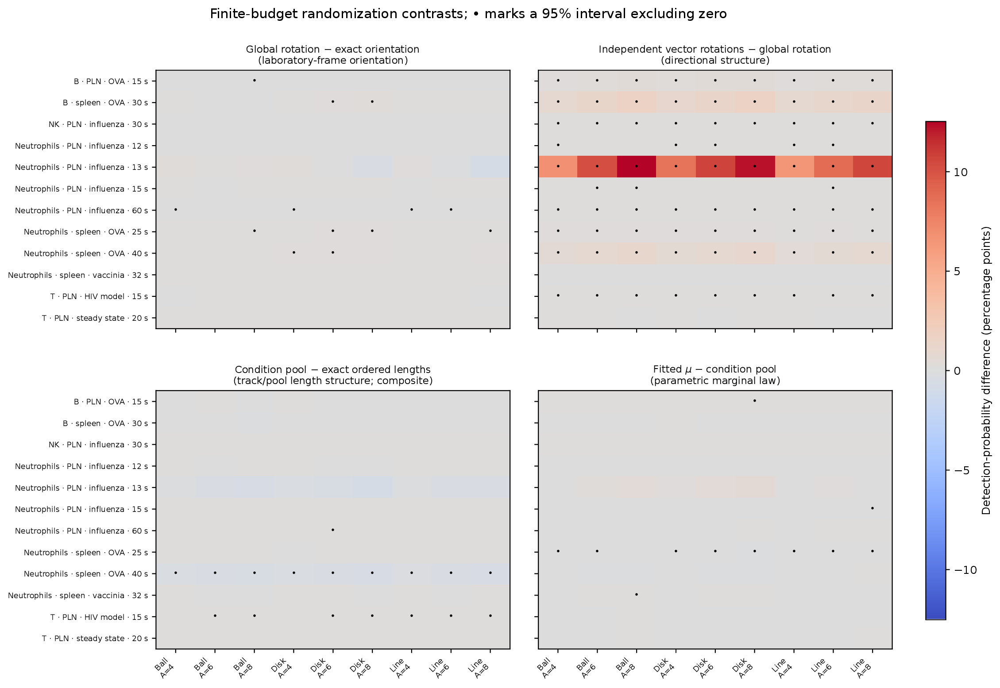
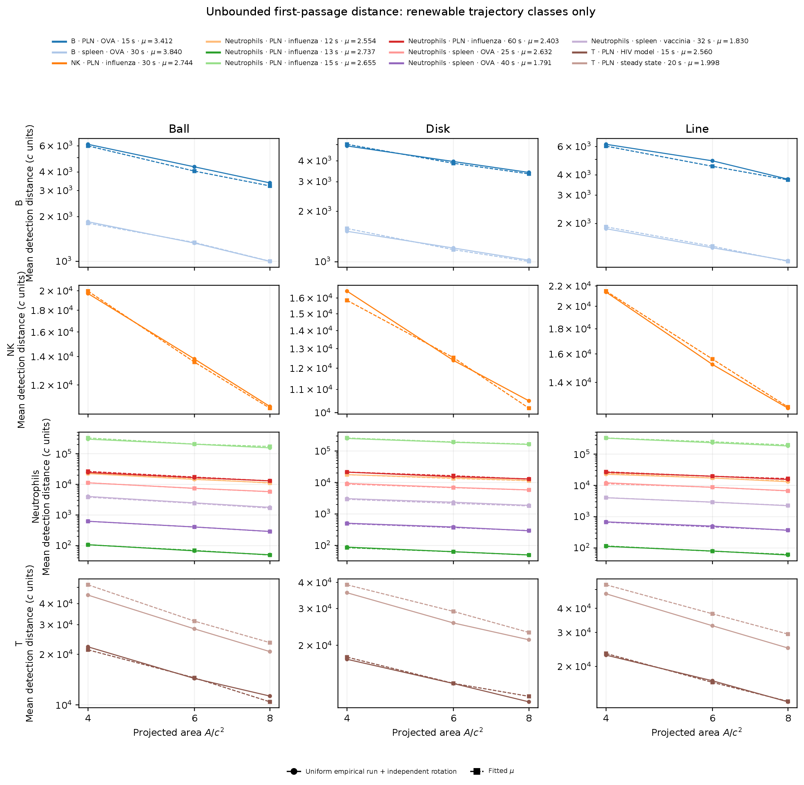
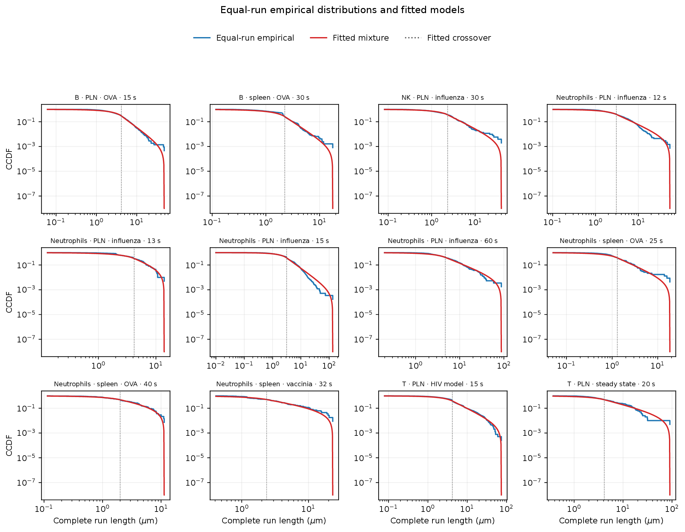
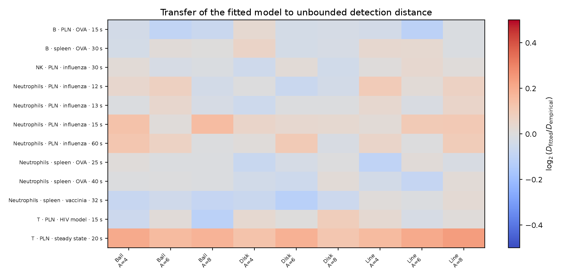
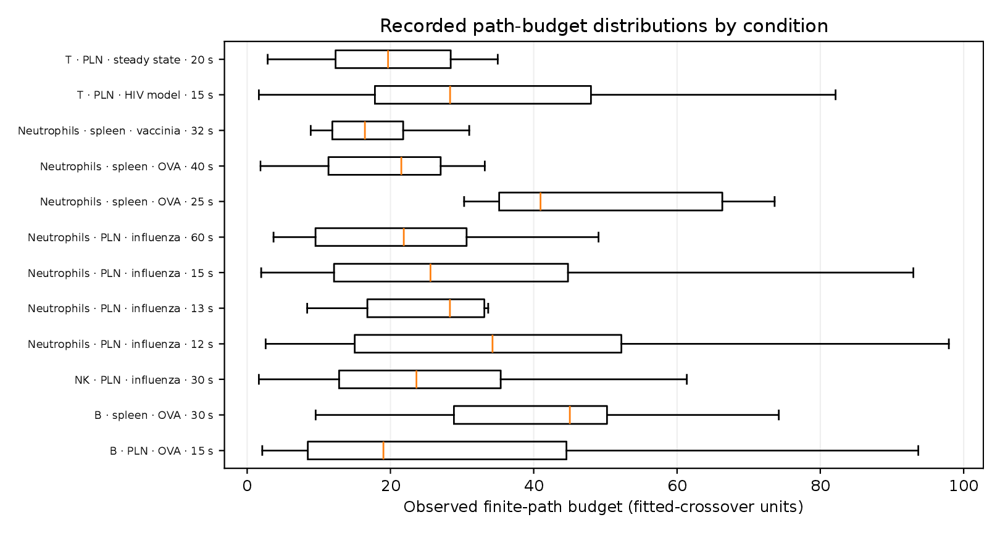
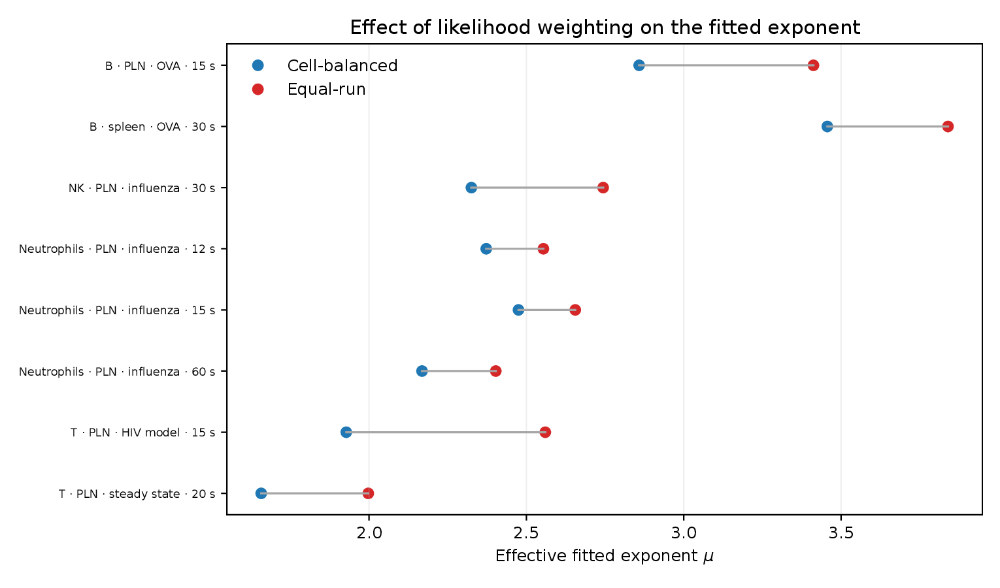

# Equal-run fits and all-condition trajectory replay

## Scope and main conclusions

This report documents the requested rerun in which every complete directed run
has the same likelihood weight. It supersedes the **cell-balanced fit** in the
earlier NK-only analysis for this comparison, while leaving the earlier outputs
unchanged.

An additive sensitivity experiment also tests a fifth finite trajectory class:
each exact track keeps its ordered run lengths, endpoint count, boundary runs,
and recorded path-length budget, but every vector is independently and
uniformly rotated in three dimensions. This directly separates intact turning
geometry from changes caused by drawing run lengths from the condition pool.
The original four-class replay remains byte-unchanged.

The analysis was performed independently for every condition containing at
least 100 complete runs. There was no substantive track-count eligibility
threshold: a condition needed only one contributing track. This admitted 12 of
the 16 observed conditions, comprising 654 tracks and 16,456 complete runs.

The main results are:

- The fitted effective exponents ranged from \(\mu=1.79\) to \(3.84\).
  Equal-run weighting increased \(\mu\) in all eight conditions that can be
  compared with the previous cell-balanced analysis, by \(0.18\) to \(0.63\).
- The fitted flat-to-power-law model should be described as an **effective
  truncated surrogate**, not as evidence for an exact Lévy law. A
  parametric-bootstrap KS test rejected it in 10 of 12 conditions, and it
  ranked first in held-out prediction in only 2 of 12 conditions.
- In finite-budget replay, global rotation of an intact observed path usually
  had little effect: 95 of 108 paired 95% intervals included zero.
- Independently rotating every vector of the same exact track, while preserving
  its ordered lengths, run count, and budget, increased detection in 95 of 108
  cells and significantly increased it in 80; none significantly decreased.
  The median probability ratio relative to a globally rotated intact track was
  \(1.225\). Thus the systematic total-randomization effect is primarily
  associated with internal directional/turning structure, not laboratory-frame
  orientation.
- Replacing this randomized focal-track sequence with complete runs sampled
  from the whole condition had a much smaller and mixed effect: 91 of 108
  intervals included zero and the median probability ratio was \(1.020\).
  This second contrast is composite, because it also changes the length
  multiset, boundary-run inclusion, track specificity, and endpoint count.
- The fitted model reproduced the independently resampled empirical control
  closely in most finite cells: 97 of 108 paired intervals included zero and
  the median fitted/empirical detection-probability ratio was \(0.988\).
- In unbounded first-passage simulations, the median ratio of fitted to
  empirical mean detection distance was \(1.002\); 86 of 108 Monte Carlo
  intervals included one. Transfer was therefore good overall but not uniform
  across conditions.

These simulations ground the theory in measured three-dimensional movement
statistics. They do not validate observed cell-target encounters because the
LTDB data contain trajectories but no matched biological target coordinates or
detection events.

A compact main-text treatment of the prespecified NK condition and the two
largest remaining run samples is available in the
[three-condition publication report](equal_run_selected_conditions_publication_report.md).

## 1. Data and directed-run construction

### 1.1 Source format

The inputs are the semicolon-delimited LTDB ground-truth files in
[`datasets/GT_TRACKS`](../datasets/GT_TRACKS). The first row stores the video
identifier, spatial calibration, and frame interval; the second is a channel
visibility row; subsequent rows contain

```text
TrackID ; x ; y ; z ; t
```

The \(x,y,z\) values are already in micrometres and \(t\) is a frame index.
Conditions were kept separate by

\[
(\text{cell type},\ \text{organ},\ \text{stimulus},\ dt),
\]

because the sampling interval changes observed displacement lengths and
turning angles.

The corpus audit found 44 selected biological files, 44,722 raw observations,
and 728 raw tracks, with no parse failure. Eighteen tracks with fewer than six
observations were removed. Preprocessing retained 44,657 observations and 710
tracks, producing 43,947 frame-to-frame displacements and 17,981 directed
runs. The configured synthetic square file was excluded.

### 1.2 From positions to directed runs

For consecutive positions, the pipeline calculated the displacement vector,
its Euclidean length, and the angle between consecutive displacements. The
primary segmentation merged consecutive moving displacements into one run
until the turning angle was strictly greater than \(90^\circ\), a zero-length
displacement was encountered, or the track ended. There was no positive speed
cutoff.

The \(90^\circ\) cutoff was a literature-informed operational threshold:
[Georgantzoglou *et al.* (2022)](https://doi.org/10.1083/jcb.202103207)
classified \(45^\circ\)–\(90^\circ\) neutrophil reorientations as small turns
and \(90^\circ\)–\(180^\circ\) changes as large U-turns. Their study did not
propose this exact three-dimensional run-segmentation algorithm, so the cutoff
is not treated as a universal biological boundary; \(45^\circ\) and
\(60^\circ\) segmentations were retained as prespecified sensitivities.

The first and last run of each track were excluded from fitting because the
recording window can censor their true lengths. Complete interior run
end-to-end lengths were used for fitting and empirical resampling. The finite
exact-path experiment restored the observed boundary vectors because they are
part of the recorded trajectory and distance budget. Thus the exact replays
and the new within-track independent-rotation control used 17,764 ordered
vectors, while the fit and uniform empirical pool used 16,456 complete
vectors.

The full derived data and exclusion flags are in
[`preprocess/runs.csv`](../outputs/equal_run_weight_run_eligible_conditions/preprocess/runs.csv),
with file, preprocessing, segmentation, and pool audits in the same stage
directory.

### 1.3 Run-count eligibility

A condition was eligible when it supplied at least 100 complete runs. Track
count did not otherwise determine eligibility. This deliberately includes
conditions with as few as six contributing tracks; the number of tracks is
still reported and used to preserve clustering in uncertainty calculations.

| Condition | Videos | Tracks | Complete runs | Status |
|---|---:|---:|---:|---|
| B · PLN · OVA · 15 s | 2 | 64 | 2,167 | included |
| B · spleen · OVA · 30 s | 1 | 26 | 1,226 | included |
| NK · PLN · influenza · 30 s | 3 | 27 | 517 | included |
| Neutrophils · PLN · influenza · 12 s | 4 | 46 | 1,367 | included |
| Neutrophils · PLN · influenza · 13 s | 1 | 8 | 201 | included |
| Neutrophils · PLN · influenza · 15 s | 10 | 224 | 5,829 | included |
| Neutrophils · PLN · influenza · 60 s | 3 | 44 | 569 | included |
| Neutrophils · spleen · OVA · 25 s | 2 | 6 | 232 | included |
| Neutrophils · spleen · OVA · 40 s | 1 | 11 | 138 | included |
| Neutrophils · spleen · vaccinia · 32 s | 2 | 13 | 112 | included |
| T · PLN · HIV model · 15 s | 6 | 163 | 3,899 | included |
| T · PLN · steady state · 20 s | 2 | 22 | 199 | included |

Four conditions were not fitted or replayed because they did not reach 100
complete runs:

| Excluded condition | Tracks | Complete runs | Reason |
|---|---:|---:|---|
| NK · PLN · influenza · 42 s | 4 | 31 | fewer than 100 runs |
| Neutrophils · PLN · influenza · 14 s | 4 | 33 | fewer than 100 runs |
| Neutrophils · PLN · influenza · 30 s | 7 | 58 | fewer than 100 runs |
| Neutrophils · PLN · influenza · 61 s | 0 | 0 | no contributing track and fewer than 100 runs |

The authoritative inclusion table is the
[`condition manifest`](../outputs/equal_run_weight_run_eligible_conditions/00_plan/condition_manifest.csv).

## 2. Equal-run fitting

### 2.1 Model and weighting

For directed-run length \(\ell\), each condition was fitted independently to

\[
f(\ell\mid\mu,c,L_{\max})
=
a(\mu,c,L_{\max})
\min\!\left[1,\left(\frac{\ell}{c}\right)^{-\mu}\right],
\qquad 0\leq\ell\leq L_{\max},
\]

where \(c\) is the crossover from the flat core to the power-law tail,
\(\mu\) is the effective tail exponent, \(L_{\max}\) is a finite upper cutoff,
and \(a\) normalizes the density. \(L_{\max}\) was the condition-specific
empirical maximum; \(c\) and \(\mu\) were estimated jointly by maximum
likelihood.

If condition \(k\) contained \(N_k\) complete runs, each run received

\[
w_i=\frac{1}{N_k}.
\]

Consequently, a track with more complete runs contributes more likelihood than
a shorter track. This is the intended difference from the earlier weighting
\(1/(J n_j)\), which forced every track to have equal total likelihood weight.
Equal-run likelihood weighting does **not** imply treating dependent runs as
independent biological replicates: 1,000 uncertainty bootstraps resampled whole
tracks, and the predictive comparison held out whole tracks in up to ten folds
(fewer when a condition contained fewer than ten tracks).

Goodness of fit was assessed with 500 parametric-bootstrap KS replicates, with
\(c\) and \(\mu\) refitted in every replicate. Held-out log density compared
the fitted model against truncated lognormal, exponential, Weibull, and
power-law-with-cutoff alternatives. Scores were pooled over held-out runs, in
accord with the requested equal-run estimand, with track-clustered sandwich
standard errors.

### 2.2 Fits

Intervals below are 95% whole-track clustered-bootstrap intervals. Lengths are
in micrometres.

| Condition | Tracks | Runs | \(\mu\) [95% CI] | \(c\) [95% CI] | \(L_{\max}\) | KS \(p\) | Best held-out model |
|---|---:|---:|---:|---:|---:|---:|---|
| B · PLN · OVA · 15 s | 64 | 2,167 | 3.412 [3.061, 3.731] | 4.160 [4.009, 4.429] | 47.948 | 0.0020 | truncated lognormal |
| B · spleen · OVA · 30 s | 26 | 1,226 | 3.840 [3.514, 4.194] | 2.248 [2.155, 2.345] | 17.598 | 0.0020 | fitted mixture |
| NK · PLN · influenza · 30 s | 27 | 517 | 2.744 [2.175, 3.645] | 2.332 [1.653, 2.941] | 40.043 | 0.0719 | truncated lognormal |
| Neutrophils · PLN · influenza · 12 s | 46 | 1,367 | 2.554 [2.332, 2.731] | 3.072 [2.771, 3.323] | 54.777 | 0.0020 | truncated lognormal |
| Neutrophils · PLN · influenza · 13 s | 8 | 201 | 2.737 [1.122, 5.564] | 4.187 [2.307, 6.212] | 13.916 | 0.0020 | truncated Weibull |
| Neutrophils · PLN · influenza · 15 s | 224 | 5,829 | 2.655 [2.533, 2.767] | 3.138 [3.070, 3.239] | 133.446 | 0.0020 | power law with cutoff |
| Neutrophils · PLN · influenza · 60 s | 44 | 569 | 2.403 [2.021, 2.624] | 4.709 [4.081, 5.579] | 87.539 | 0.0020 | truncated lognormal |
| Neutrophils · spleen · OVA · 25 s | 6 | 232 | 2.632 [1.864, 2.980] | 1.302 [1.030, 1.430] | 18.435 | 0.0020 | power law with cutoff |
| Neutrophils · spleen · OVA · 40 s | 11 | 138 | 1.791 [1.182, 3.413] | 2.002 [1.278, 4.235] | 11.318 | 0.5788 | truncated lognormal |
| Neutrophils · spleen · vaccinia · 32 s | 13 | 112 | 1.830 [1.184, 2.318] | 2.363 [1.206, 3.625] | 23.072 | 0.0100 | truncated lognormal |
| T · PLN · HIV model · 15 s | 163 | 3,899 | 2.560 [2.378, 2.732] | 4.187 [4.134, 4.261] | 73.797 | 0.0020 | fitted mixture |
| T · PLN · steady state · 20 s | 22 | 199 | 1.998 [1.303, 2.269] | 4.142 [2.775, 5.448] | 90.660 | 0.0060 | truncated lognormal |

Only the NK 30-s and neutrophil spleen OVA 40-s fits were not rejected at
\(5\%\). Although the fitted mixture ranked first for B-cell spleen OVA and
T-cell HIV-model data, its held-out advantage over the best alternative was
negligible under the pipeline's support criterion. No condition therefore
provided clear unique support for this family.

The exponent comparison is biologically suggestive but not a controlled
cell-type comparison. Cell identity is confounded with organ, stimulus,
sampling interval, video, and track-length distributions. In particular, the
small-track conditions have appropriately broad clustered intervals.

### 2.3 Effect of changing the likelihood weights

For the eight conditions present in the earlier cell-balanced fit, the changes
in \(\mu\) were:

| Condition | Cell-balanced \(\mu\) | Equal-run \(\mu\) | Change |
|---|---:|---:|---:|
| B · PLN · OVA · 15 s | 2.858 | 3.412 | +0.554 |
| B · spleen · OVA · 30 s | 3.456 | 3.840 | +0.384 |
| NK · PLN · influenza · 30 s | 2.325 | 2.744 | +0.419 |
| Neutrophils · PLN · influenza · 12 s | 2.372 | 2.554 | +0.182 |
| Neutrophils · PLN · influenza · 15 s | 2.475 | 2.655 | +0.181 |
| Neutrophils · PLN · influenza · 60 s | 2.168 | 2.403 | +0.234 |
| T · PLN · HIV model · 15 s | 1.928 | 2.560 | +0.632 |
| T · PLN · steady state · 20 s | 1.657 | 1.998 | +0.340 |

Giving the runs from longer tracks their full numerical influence therefore
produced steeper fitted effective tails in every overlapping condition. Because
\(c\) and \(\mu\) were estimated jointly, this should be interpreted as a
change in the fitted distribution and estimand, not as a stand-alone claim
about tail frequency or evidence that either weighting is universally
preferable.

## 3. Search simulations

### 3.1 Condition-specific normalization

Each fitted condition was normalized by its own crossover,

\[
\ell^*=\ell/c,\qquad c^*=1,\qquad d=1.
\]

The torus side was set to

\[
W=2L_{\max}^*=\frac{2L_{\max}}{c}.
\]

Thus one model length unit and the detection radius both equal the fitted
condition-specific \(c\), which ranges from \(1.302\) to \(4.709\,\mu\mathrm m\).
The common projected-area grid was

\[
A/c^2\in\{4,6,8\}
\]

for Ball, Disk, and Line targets. The dimensions were chosen to match maximum
face-on projected capture area, including \(d=1\). These relatively small
areas were required by the shortest normalized torus, the neutrophil PLN
13-s condition. All 108 condition/shape/area targets passed the strict
no-periodic-self-overlap check; the minimum remaining clearance was 1.109
model units.

The normalization makes the theory comparison dimensionless, but it also
means that a common plotted \(A/c^2\) is not a common physical area:
\(A_{\mu\mathrm m^2}=A c^2\). Cross-condition curves should therefore be read
as comparisons at matched **normalized**, not matched physical, geometry.
Because the torus side is \(2L_{\max}/c\), it also differs among conditions;
the primary inferential contrasts are therefore between trajectory classes
within the same condition and target geometry.

### 3.2 Finite recorded-distance experiment

Each retained track supplied its observed cumulative directed-run length as
the finite path budget. Specifically, for track \(j\) in condition \(k\),

\[
B_{jk}^{(\mu\mathrm m)}
  =\sum_{r\in\mathcal R_{jk}^{\mathrm{exact}}}\lVert\mathbf v_{jkr}\rVert,
\qquad
B_{jk}=\frac{B_{jk}^{(\mu\mathrm m)}}{c_k}.
\]

Here \(\mathcal R_{jk}^{\mathrm{exact}}\) contains every positive-length
segmented run vector from a track represented in the fitted population,
including its boundary-censored first and last run segments. This differs from
the fitting and empirical-resampling pool, which contains only complete runs.
Thus there was no single condition-wide budget: every retained track kept its
own observed \(B_{jk}\), and every trajectory class received that same budget
when replaying that track. Starting positions were uniform on the torus. A
synthetic step was included only when its full length fit within the remaining
budget; the first overshooting step was discarded rather than shortened. Five
constructions were compared:

| Trajectory class | Construction | Purpose |
|---|---|---|
| Exact orientation | Original ordered directed-run vectors | Replays the measured path |
| Exact + global rotation | One Haar-uniform 3-D rotation of the entire path | Removes laboratory-frame orientation while preserving every length and turning angle |
| Exact lengths/order + independent rotations | Original ordered directed-run lengths, with a separate Haar-uniform 3-D rotation applied to every directed-run vector | Removes within-track directional and turning structure while preserving that track's lengths, order, endpoint count, boundary runs, and budget |
| Uniform empirical run + independent rotation | Sample one of the condition's complete vectors uniformly with replacement and rotate every draw independently | Preserves the equal-run empirical length pool while removing order and directional correlation |
| Fitted \(\mu\) | Draw from the fitted finite mixture and choose an isotropic direction | Replays the theoretical surrogate |

The condition-wide empirical pool contains complete runs from the focal track
as well as other tracks in that condition; it is not a leave-one-track-out
pool. Consequently, the contrast between that class and the new within-track
control is composite: it changes the focal length multiset, excludes boundary
runs, resamples run order, and can change the number of accepted endpoints
within a fixed budget.

There were 10,000 replays per track, trajectory class, shape, and area. The
original four classes required 235.44 million trajectory-target evaluations;
the additive within-track control required 58.86 million, for 294.30 million
across all five classes. Every track had the same number of trials, so reported
finite probabilities are equally averaged over tracks. Uncertainty and paired
contrast intervals used 1,000 whole-track bootstrap replicates.

### 3.3 Unbounded first-passage experiment

An exact recorded path ends and cannot provide an uncensored first-passage
distance without inventing a recycling rule. The unbounded experiment
therefore compared only the renewable empirical and fitted classes. Each path
continued until first detection, with 2,000 trials for every condition, class,
shape, and area: 432,000 trials in total.

The primary outcome is cumulative path length at detection. First-hit directed
run count is also saved, but it is not physical time; a duration model would be
required to express it in seconds.

Detection was evaluated at relocation endpoints, not continuously along swept
segments, and the initial position was not counted as a detection. The replay
used a 32-worker Python process pool with C-compatible target geometry. The
normalization matches the existing C sampler's \(c=1,d=1\) convention, but the
C program was not used because it truncates \(L_{\max}\) and torus side to
integers and cannot consume empirical vector pools or finite recorded paths.

## 4. Replay results

### 4.1 Finite detection probability

Global rotation had only a small effect on intact paths. Of the 108
condition/shape/area cells, 95 paired intervals for globally rotated minus
exact orientation included zero; 8 were significantly positive and 5
significantly negative. There is therefore no general laboratory-frame
orientation effect.

The new within-track control identifies where the main randomization effect
arises. Independently rotating every vector of the same track, relative to one
global rotation of the intact track, increased the point estimate in 95 of 108
cells. Eighty increases were significant, none of the decreases were
significant, and 28 intervals included zero. Its detection-probability ratio
relative to the globally rotated intact track had median \(1.225\),
interquartile range \(1.127\)–\(1.441\). All nine NK cells increased
significantly, with a condition-median ratio of \(1.435\). Because lengths,
length order, boundary runs, endpoint count, and budget are unchanged, this
contrast specifically implicates the intact paths' directional and turning
structure rather than laboratory-frame orientation.

Replacing that within-track sequence with independently sampled complete runs
from the full condition pool produced a much smaller, mixed change. The
pool-minus-within-track point estimate was positive in 65 cells and negative
in 43; 91 intervals included zero, eight were significantly positive, and nine
were significantly negative. The median probability ratio was \(1.020\)
(interquartile range \(0.989\)–\(1.068\)). For NK cells, all nine point
estimates increased, but none significantly, and the condition-median ratio
was \(1.049\). This is not an ordering-only test because pool sampling also
changes the track-specific length multiset, boundary-run inclusion, endpoint
count, and source-track composition.

For continuity with the original four-class analysis, the aggregate
pool-minus-global contrast remains positive in 99 of 108 cells, significantly
positive in 73, and never significantly negative. The new decomposition shows
that most of this systematic gain appears at the within-track
direction-randomization step.

The fitted model was much closer to the independent empirical control:

- 97 of 108 paired intervals for fitted minus empirical included zero;
- the fitted/empirical probability ratio had median \(0.988\), interquartile
  range \(0.966\)–\(1.006\), and full range \(0.883\)–\(1.068\);
- nine significantly negative cells were concentrated in neutrophil spleen
  OVA 25 s (eight cells) and neutrophil PLN 15 s (one cell); two cells were
  significantly positive.

This supports the claim that the fitted marginal run-length model captures
most of the search behavior of independently oriented empirical runs. It does
not reproduce the higher-order directional and turning correlations of the
observed paths.

### 4.2 Unbounded detection distance

Across all 108 cells, the fitted/empirical mean-distance ratio had median
\(1.002\), interquartile range \(0.978\)–\(1.027\), and range
\(0.920\)–\(1.180\). Eighty-six Monte Carlo intervals included one, five cells
favored significantly shorter fitted-model distances, and 17 favored
significantly longer fitted-model distances.

The largest coherent discrepancy was the T-cell steady-state condition: all
nine fitted-model distances were significantly longer, by approximately
8%–18%. The neutrophil PLN 15-s condition had four significantly longer cells,
whereas the B-cell PLN condition had two significantly shorter cells. The NK
condition was particularly close: all nine intervals included one and its
condition-median ratio was \(1.004\).

Detection probability increased, and unbounded distance decreased, as target
area increased. Ball, Disk, and Line targets with the same projected area need
not have the same three-dimensional capture volume, so shape effects reflect
geometry as well as movement. Across the complete grid, the median finite
probability ratios relative to Ball were approximately \(1.08\) for Disk and
\(0.87\) for Line; the corresponding empirical unbounded-distance ratios were
approximately \(0.92\) and \(1.15\).

The interval counts above are descriptive summaries of the complete grid; no
multiple-comparison adjustment was applied.

## 5. Figures

The plots are embedded below as PNG previews. Click any preview to open the
corresponding publication-quality vector PDF.

### 5.1 Fitted exponents

**How to read it.** Each row is one condition. The point is the equal-run
maximum-likelihood estimate of \(\mu\), and the horizontal line is its 95%
whole-track clustered-bootstrap interval. Colors identify cell groups. The
dashed vertical reference is \(\mu=2\). Filled points have parametric-bootstrap
KS \(p\geq0.05\); open points have \(p<0.05\). Within this finite model, larger
\(\mu\) means a more rapidly decaying power-law component and therefore
relatively fewer very long runs.

[](../outputs/equal_run_weight_run_eligible_conditions/ordered_length_rotation_replay/figures/fitted_exponents_by_condition.pdf)

**What it shows.** Point estimates range from \(1.79\) to \(3.84\). The
neutrophil PLN 13-s interval is especially wide because that condition has only
eight tracks and 201 complete runs. Only the NK condition and neutrophil spleen
OVA 40-s condition are not rejected by the KS test; the other ten conditions
show statistically detectable departures from the fitted family.

**Interpretation.** The between-condition variation is useful for comparing
effective movement regimes, but it is not evidence that cell identity alone
causes the difference: organ, stimulus, sampling interval, sample size, and
video also vary. The mostly rejected KS fits are why \(\mu\) is treated here as
an effective summary parameter rather than proof of an exact Lévy law.

### 5.2 Finite detection probabilities

**How to read it.** The horizontal axis is normalized projected target area,
\(A/c^2\), and the vertical axis is the percentage of trials detecting the
target before exhausting the recorded track's path-length budget. Columns show
Ball, Disk, and Line targets; rows show cell groups; colors identify conditions.
Markers and line styles distinguish exact orientation, exact path plus one
global rotation, exact-track lengths with every vector independently rotated,
independently sampled and rotated condition-pool runs, and the fitted-\(\mu\)
model. Higher curves mean greater finite-budget detection probability.

[](../outputs/equal_run_weight_run_eligible_conditions/ordered_length_rotation_replay/figures/finite_detection_probability_by_condition.pdf)

**What it shows.** Detection increases with target area. Exact orientation and
global rotation almost overlap: 95 of 108 paired intervals include zero, so
there is no general laboratory-frame orientation effect. Independently
rotating each vector within the same exact track is higher in 95 cells and
significantly higher in 80, with median ratio \(1.225\) relative to global
rotation. Moving from that control to condition-pool resampling is much less
systematic: 91 intervals include zero and the median ratio is \(1.020\). The
fitted model closely follows the pool control: 97 of 108
fitted-minus-empirical intervals include zero, and the median
fitted/empirical ratio is \(0.988\).

**Interpretation.** The dominant gain occurs when the intact track's internal
directions and turning geometry are destroyed while its exact run lengths,
length order, boundary runs, endpoint count, and budget remain fixed.
Condition-pool sampling has a smaller residual effect, although that contrast
also changes track-specific lengths and endpoint counts and is therefore not an
ordering-only intervention. Agreement between the fitted and pool curves shows
that the fitted marginal run-length law captures most of that randomized
control, not the higher-order structure of the exact tracks. Absolute heights
should not be compared causally across conditions because their recorded
budgets and normalized torus sizes differ.

### 5.3 Finite randomization contrasts

**How to read it.** Rows are conditions and columns are the nine target
shape/area combinations. Each panel is one adjacent randomization step, shown
as a paired detection-probability difference in percentage points: global
rotation minus exact orientation; independent vector rotations within the
same track minus global rotation; condition-pool sampling minus within-track
rotations; and fitted model minus condition-pool sampling. Red is an increase,
blue is a decrease, and a dot marks a whole-track 95% bootstrap interval that
excludes zero. The shared color scale permits effect-size comparison across
the four steps.

[](../outputs/equal_run_weight_run_eligible_conditions/ordered_length_rotation_replay/figures/finite_randomization_contrasts_by_condition.pdf)

**What it shows.** The strongest and most coherent red block is the
within-track independent-rotation step, particularly for NK and several
neutrophil conditions. Global orientation effects are sparse. The
condition-pool-minus-within-track panel is weaker and mixed, while the
fitted-minus-pool panel is predominantly near zero. A few large absolute
effects, especially in the neutrophil PLN 13-s row, set the common scale and
should be viewed alongside that condition's small track count and wide fit
uncertainty.

**Interpretation.** The staged randomization localizes the main empirical
difference to directional and turning structure inside observed tracks. It
does not establish that any individual turning statistic is causal, and the
pool step remains composite because it also replaces the focal track's length
multiset and boundary runs. Dots summarize unadjusted cell-wise intervals; no
multiple-comparison correction was applied.

### 5.4 Unbounded detection distances

**How to read it.** The horizontal axis is \(A/c^2\); the logarithmic vertical
axis is mean cumulative path length to first detection in crossover units.
Lower values indicate more efficient search. Rows, columns, and colors have the
same meanings as in the finite plot. Solid lines with circles are independently
rotated empirical runs; dashed lines with squares are fitted-\(\mu\) runs.
Each condition's color key also reports its equal-run fitted exponent.
Exact recorded paths are absent because a finite path cannot be extended
indefinitely without inventing a recycling rule.

[](../outputs/equal_run_weight_run_eligible_conditions/ordered_length_rotation_replay/figures/unbounded_detection_distance_by_condition.pdf)

**What it shows.** Mean detection distance falls as target area grows. The
empirical and fitted curves are usually nearly superposed: across all 108
condition/shape/area cells, the fitted/empirical distance ratio has median
\(1.002\), with interquartile range \(0.978\)–\(1.027\), and 86 intervals
include one. The NK condition is especially close, with all nine intervals
including one and a condition-median ratio of \(1.004\). The clearest exception
is steady-state T cells, for which all nine fitted distances are approximately
8%–18% longer.

**Interpretation.** The fitted marginal law generally predicts the
first-passage distance of the randomized empirical control, but transfer is
condition dependent. Disk targets tend to require less travel than Ball
targets of equal projected area, while Line targets tend to require more;
equal projected area does not imply equal three-dimensional capture volume.
Detection is evaluated only at relocation endpoints, so these conclusions do
not automatically extend to continuous swept-path detection.

### 5.5 Empirical and fitted run-length distributions

**How to read it.** Both axes are logarithmic. The horizontal axis is complete
directed-run length in micrometres, and the vertical axis is the complementary
cumulative probability \(\Pr(L\geq \ell)\). Blue steps are the equal-run
empirical distributions, red curves are the fitted finite mixture, and each
vertical dotted line is the fitted crossover \(c\). The fitted support ends at
the observed \(L_{\max}\).

[](../outputs/equal_run_weight_run_eligible_conditions/ordered_length_rotation_replay/figures/fit_ccdf_diagnostics.pdf)

**What it shows.** The fitted curves reproduce the broad central shape in many
conditions, but visible tail departures remain—for example in neutrophil PLN
15-s and steady-state T-cell tracks. Such discrepancies matter because rare
long runs can influence first-passage behavior even when most of the
distribution is reproduced.

**Interpretation.** Visual proximity alone should not be read as goodness-of-fit
acceptance: ten of twelve parametric-bootstrap KS tests reject the model, and
alternative truncated distributions often have better held-out log scores.
Nevertheless, the replay experiments show that the fitted law can still be a
useful effective surrogate for the independently randomized empirical process.

### 5.6 Unbounded fitted-to-empirical distance ratios

**How to read it.** Rows are conditions and columns are the nine target
shape/area combinations. Color represents
\(\log_2(D_{\mathrm{fitted}}/D_{\mathrm{empirical}})\). Neutral gray means equal
mean detection distance; red means the fitted process travels farther and is
less efficient; blue means it travels less far and is more efficient. Because
the scale is logarithmic, equal-magnitude red and blue deviations represent
reciprocal ratios.

[](../outputs/equal_run_weight_run_eligible_conditions/ordered_length_rotation_replay/figures/unbounded_fitted_to_empirical_ratio.pdf)

**What it shows.** Most cells are close to neutral, consistent with the overall
median ratio of \(1.002\). The NK row is uniformly near zero. The steady-state
T-cell row is coherently red across all shapes and areas, exposing the strongest
systematic loss of efficiency under the fitted model. Neutrophil PLN 15-s also
leans toward longer fitted distances, whereas some B-cell PLN cells favor the
fitted process slightly.

**Interpretation.** This plot is a transfer diagnostic, not another fit
diagnostic: it asks whether differences between fitted and empirical
run-length distributions materially change search performance. It displays
effect sizes only; uncertainty must be read from the contrast tables and the
counts reported in Section 4.2. No multiple-comparison correction was applied.

### 5.7 Finite path-budget distributions

**How to read it.** Each value is one track's cumulative positive-length
segmented-run distance—including boundary-censored first and last
segments—divided by that condition's fitted crossover \(c\). The fit itself
still uses only complete runs. The orange line is the median, the box spans the
interquartile range, and the whiskers extend to the usual
1.5-interquartile-range limits; individual outliers are suppressed. Larger
values allow more movement—and therefore more chances to detect a target—in
the finite experiment.

[](../outputs/equal_run_weight_run_eligible_conditions/ordered_length_rotation_replay/figures/finite_budget_distributions.pdf)

**What it shows.** Available search effort differs substantially both within
and among conditions. Several conditions, including B-cell PLN, neutrophil PLN
12-s and 15-s, and T-cell HIV, have broad budget distributions, while others
are much tighter. These differences help explain why absolute finite
detection probabilities can vary greatly across panels.

**Interpretation.** Preserving each measured track's budget makes the finite
replay faithful to recorded observation lengths, but it also means that
cross-condition detection levels combine movement behavior with unequal
observation effort. The strongest comparisons are therefore between trajectory
classes evaluated on the same tracks, not between cell groups.

### 5.8 Effect of likelihood weighting on \(\mu\)

**How to read it.** Each row is one of the eight conditions present in both
analyses. Blue points are the earlier cell-balanced estimates, in which every
track contributed equal total likelihood weight. Red points are the new
equal-run estimates, in which every complete run has equal weight. Gray
segments connect estimates for the same condition.

[](../outputs/equal_run_weight_run_eligible_conditions/ordered_length_rotation_replay/figures/weighting_effect_on_mu.pdf)

**What it shows.** The equal-run estimate is higher in all eight overlapping
conditions, although the size of the shift varies. The largest visual shifts
occur for the HIV-model T-cell condition and several B/NK conditions; the
neutrophil estimates move less.

**Interpretation.** The systematic shift shows that run-length distributions
vary with track length: allowing tracks with more runs to contribute more
changes the fitted estimand. Neither weighting is universally “correct.”
Equal-run weighting answers the question posed here—what distribution is seen
by a uniformly selected complete run—whereas cell-balanced weighting answers
what is seen after selecting a track uniformly first. This plot compares point
estimates only and does not imply that equal-run weighting improves formal
goodness of fit.

Condition-specific finite and unbounded PDFs are also saved under
[`condition_replays`](../outputs/equal_run_weight_run_eligible_conditions/condition_replays);
those original condition-level finite plots contain the four baseline classes.
The unified five-class cross-condition plot is in the additive stage linked
above.

## 6. Reviewer-facing interpretation

A concise paper-level statement is:

> We extracted directed runs from three-dimensional immune-cell trajectories
> and fitted a finite flat-to-power-law relocation model separately to 12
> conditions, weighting every complete run equally. The resulting effective
> exponents ranged from 1.79 to 3.84. After normalizing each condition by its
> fitted crossover, we replayed the observed paths and three progressively
> randomized empirical controls against shape-matched targets in a periodic
> domain and compared them with the fitted model. Random global rotation of an
> observed path had little effect. In contrast, independently rotating every
> vector of the same track—while preserving its exact ordered run lengths and
> travel budget—increased detection in 95 of 108 target settings, with 80
> significant increases. Replacing those lengths with runs sampled from the
> condition pool produced a much smaller, mixed change. Thus the primary
> empirical effect is associated with within-track directional and turning
> structure. The fitted model closely reproduced the independently sampled
> empirical control in most finite and unbounded target configurations,
> although statistically adequate run-length fits and condition-specific
> transfer were not universal. We therefore interpret the fitted law as an
> effective movement surrogate rather than evidence for an exact Lévy
> mechanism.

This addresses the request to test theoretical predictions using empirical
movement data while being explicit that the encounter outcomes are
counterfactual simulations, not observed target detections.

## 7. Limitations

1. LTDB supplies trajectories but no matched targets or observed encounters.
2. Conditions are observational and differ in cell type, organ, stimulus,
   sampling interval, video, and sample size; exponent differences cannot be
   attributed to cell type alone.
3. Run-only eligibility admits conditions with 6–13 tracks. Equal-run
   likelihood weighting lets long tracks contribute more, while whole-track
   bootstrap intervals only partially address limited biological replication.
4. Ten of twelve KS tests reject the fitted family, and alternative
   distributions often predict held-out runs better. \(\mu\) is an effective
   comparison parameter. The parametric KS bootstrap reproduces the fitted
   run-length distribution but not within-track clustering.
5. Directed runs depend on the \(90^\circ\) segmentation rule and absence of a
   speed cutoff. Segmentation and crossover sensitivity outputs should
   accompany any strong mechanistic claim.
6. The within-track control preserves exact run lengths and their order, but
   independently rotating all vectors jointly removes turning angles,
   directional persistence, and every higher-order angular correlation. It
   does not identify a single angular statistic as causal.
7. The condition-pool control includes complete runs from the focal track and
   other tracks; it is not leave-one-track-out. Relative to the within-track
   control, it also changes the length multiset, excludes boundary runs,
   resamples length order, and can change the number of endpoints within a
   fixed budget.
8. Detection is endpoint-only. Continuous swept-path detection could alter the
   ranking, especially for long runs.
9. Geometry is matched in normalized projected area, not physical area or
   three-dimensional capture volume.
10. Replay intervals are conditional on the fitted parameters and empirical
   pools; they do not propagate full fit, target, or between-video
   uncertainty.

## 8. Runtime estimate, reproducibility, and artifact map

Before the full execution, the saved 32-core estimate was 41.9 minutes, with a
30.9–58.2 minute range and 219–279 MB expected storage. Its components were
1 minute for inspection/preprocessing, 27 minutes for fitting and sensitivity
analysis, 10.9 minutes for replay, and 3 minutes for combined tables, PDFs, and
validation. The estimate and its assumptions are preserved in
[`00_plan/runtime_estimate.csv`](../outputs/equal_run_weight_run_eligible_conditions/00_plan/runtime_estimate.csv)
and [`00_plan/plan.json`](../outputs/equal_run_weight_run_eligible_conditions/00_plan/plan.json).
The completed end-to-end run took approximately 34 minutes and occupied
221 MiB, both within the saved pre-run ranges.

Before running the additive within-track rotation control, its separate
32-core estimate was 0.5–2 minutes (central estimate 1 minute), 12–16 MiB, and
58.86 million evaluations. The production execution took approximately
21 seconds and its isolated stage contains 25 files totaling 2.9 MB. The
estimate and actual timing are preserved in
[`ordered_length_rotation_replay/00_plan/plan.md`](../outputs/equal_run_weight_run_eligible_conditions/ordered_length_rotation_replay/00_plan/plan.md),
[`runtime_estimate.csv`](../outputs/equal_run_weight_run_eligible_conditions/ordered_length_rotation_replay/00_plan/runtime_estimate.csv),
and
[`actual_runtime.md`](../outputs/equal_run_weight_run_eligible_conditions/ordered_length_rotation_replay/00_plan/actual_runtime.md).
The baseline tree was hashed before and after this stage and remained exactly
unchanged.

The complete isolated output root is
[`outputs/equal_run_weight_run_eligible_conditions`](../outputs/equal_run_weight_run_eligible_conditions).
No earlier analysis output was overwritten.

| Stage directory | Contents |
|---|---|
| [`00_plan`](../outputs/equal_run_weight_run_eligible_conditions/00_plan) | condition eligibility, planned workload, runtime/storage estimate |
| [`inspect`](../outputs/equal_run_weight_run_eligible_conditions/inspect) | source-file audit and selection |
| [`preprocess`](../outputs/equal_run_weight_run_eligible_conditions/preprocess) | observations, displacements, runs, pools, exclusions, segmentation sweep |
| [`fit`](../outputs/equal_run_weight_run_eligible_conditions/fit) | primary fits, clustered bootstrap draws, KS tests, model comparison, crossover and segmentation sensitivities |
| [`condition_replays`](../outputs/equal_run_weight_run_eligible_conditions/condition_replays) | complete inputs, targets, finite summaries/contrasts, unbounded trials/summaries, settings, and PDFs for each condition |
| [`all_conditions_replay`](../outputs/equal_run_weight_run_eligible_conditions/all_conditions_replay) | combined machine-readable tables and all cross-condition PDFs |
| [`ordered_length_rotation_replay`](../outputs/equal_run_weight_run_eligible_conditions/ordered_length_rotation_replay) | additive within-track independent-rotation results, five-class augmented tables, paired contrasts, runtime records, and the unified eight-PDF figure suite |

Especially useful primary finite tables after the additive experiment are the
[`five-class finite summary`](../outputs/equal_run_weight_run_eligible_conditions/ordered_length_rotation_replay/augmented_finite_summary.csv)
and
[`five-contrast paired table`](../outputs/equal_run_weight_run_eligible_conditions/ordered_length_rotation_replay/augmented_finite_contrasts.csv).
The stage-only results are
[`within-track finite summaries`](../outputs/equal_run_weight_run_eligible_conditions/ordered_length_rotation_replay/finite_summary.csv)
and
[`new paired contrasts`](../outputs/equal_run_weight_run_eligible_conditions/ordered_length_rotation_replay/finite_contrasts.csv).
Other useful combined tables are the
[`fit summary`](../outputs/equal_run_weight_run_eligible_conditions/all_conditions_replay/fit_summary.csv),
[`unbounded summary`](../outputs/equal_run_weight_run_eligible_conditions/all_conditions_replay/unbounded_summary.csv),
[`unbounded contrasts`](../outputs/equal_run_weight_run_eligible_conditions/all_conditions_replay/unbounded_contrasts.csv),
and [`target feasibility table`](../outputs/equal_run_weight_run_eligible_conditions/all_conditions_replay/target_feasibility.csv).
Every CSV has a metadata sidecar, and per-condition settings contain a replay
signature for checkpoint validation.

The configuration is
[`configs/equal_run_weight_run_eligible_conditions.yaml`](../configs/equal_run_weight_run_eligible_conditions.yaml).
The analysis can be reproduced with:

```bash
.venv/bin/python -m ltdb_levy inspect \
  --config configs/equal_run_weight_run_eligible_conditions.yaml
.venv/bin/python -m ltdb_levy preprocess \
  --config configs/equal_run_weight_run_eligible_conditions.yaml
.venv/bin/python -m ltdb_levy all-conditions-replay \
  --config configs/equal_run_weight_run_eligible_conditions.yaml \
  --estimate-only --projected-areas 4 6 8 --finite-replays 10000 \
  --unbounded-trials 2000 --workers 32
.venv/bin/python -m ltdb_levy fit \
  --config configs/equal_run_weight_run_eligible_conditions.yaml
.venv/bin/python -m ltdb_levy all-conditions-replay \
  --config configs/equal_run_weight_run_eligible_conditions.yaml \
  --projected-areas 4 6 8 --finite-replays 10000 \
  --unbounded-trials 2000 --workers 32 \
  --finite-batch-size 1000 --unbounded-chunk-trials 25 \
  --unbounded-step-block 256
PYTHONPATH=. .venv/bin/python -m ltdb_levy.cli ordered-rotation-replay \
  --config configs/equal_run_weight_run_eligible_conditions.yaml \
  --finite-replays 10000 --workers 32 \
  --finite-batch-size 1000 --seed 913579
```
